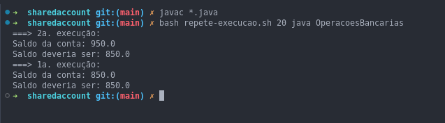

# Prática: Programação Concorrente em Java

## Objetivos
Nesta prática você vai exercitar mais conceitos de programação concorrente e orientada a objetos em Java. Em particular, vamos trabalhar com **sincronização** de threads, para tratar **condições de corrida** (*race conditions*) no acesso a **dados compartilhados**.

## Prática

1. Alalisar o códio e executar o programa `OperacoesBancarias.java` utilizando o script fornecido. Identificar o funcionamento utilizando a palavra-chave `synchronized` e após remover a palavra-chave com intuito de identificar os erros de sincronização.

2. Capture uma imagem de alguma execução com resultado correto e outra com resultado incorreto. Entregue estas imagens no repositório de entrega, dentro de uma pasta nomeada `sharedaccount` (exatamente desta forma, só em minúsculas).

#### Imagem utilizando a palavra-chave `synchronized`

#### Imagem removendo a palavra-chave `synchronized`

